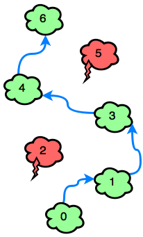

## Consigna

Dada una serie de nubes, tenemos que informar qué cantidad mínima de saltos sería necesaria para recorrer todo el trayecto.

Se puede saltar las nubes de 1 en 1 o de a dos.

Hay nubes "thunderheads" y "cumulus". Siendo cumulus las "buenas", y thunderheads las "malas".

No se puede pisar las nubes malas.

Ejemplo de recorrido con saltos simples:

Ejemplo de un recorrido con salto doble:
